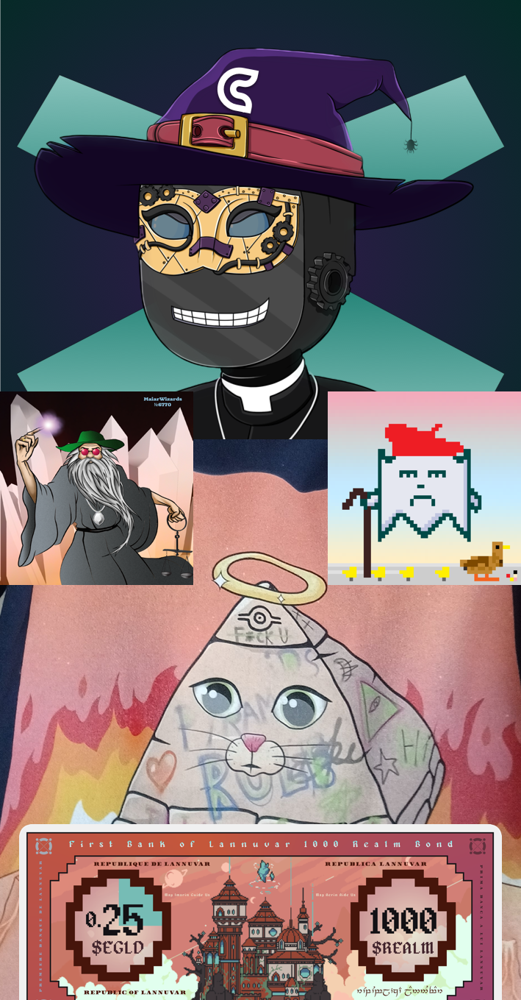
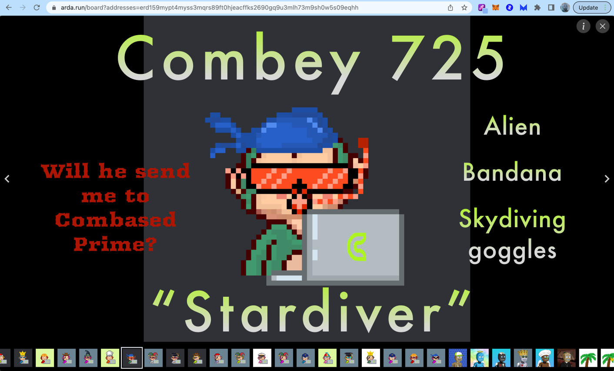
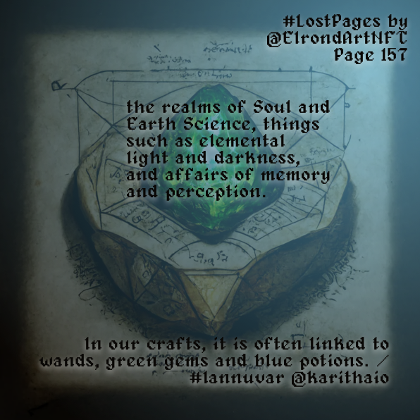

Who is the guy behind j4cks? Sorry, I'm not comfortable fully doxxing in 2023Q1. I'll give you some background here so you'll know why I'm so passionate about building communities and projects on MultiversX, tho.

# whom

First off, which brands do I consider worth your time, in MultiversX, in 2023?
Here's a quick list just in case you came here to find this out, too.

1. Combased / ComVerse
2. MaiarGhost (MxGhost)
3. MaiarWizards 
4. New Degen Order
5. Lannuvar (SubDAO of Realmx.io)

Other people know more about other projects, and they can vouch for them, or not. I can vouch for these. I've ranked then in descending order of their estimated capital inflows, as of this quarter (2023Q1).

> 
> #### Stardiver, one of my rarest ComVerse Combeys

# but why ser

Why does the idea of a DAO (Decentralized, Autonomous (run by software) Organization) appeal to me? I believe strongly in a future in which humans can trust one another in a new type of capitalism. I also believe that the DAO concept, versus the current corporation concept, is what can take us as a ppl to this next level of civilization.

So even wen I'm writing pithy posts abt absurd pop art jpgs, I'm also tapping in to a deep ethical drive to make this world a better place, by repping the idea of transacting business on chain; *by 'on chain', I mean in public, on a transparent record like a blockchain*.

As to my thoughts about web3 & ElrondNetwork and what has transpired as we've transformed into MultiversX, read on. It's a WIP collecting all my documented ideas on this, going back over a year now. I will comb thru records and add details to each month as I go, filling in backwards.

> 
> #### Promotion I created for the Lost Pages NFT collection

The facts of the matter are that I've had a hand in building 2 of the projects I've mentioned above, and I intend to help all 5 of them flourish. I've operated as a freelance promoter/brand agent for all of 2022, repping whatever I felt passionately abt at the time. I also wrote fiction (some call it Lore) and some smol amount of website code, and I discovered a passion for editing images and making brand posts. 

Is web3 on MultiversX a typical capitalist landscape rn? Heck no! Only once last year did I receive a direct payment for work; all incomes were passive rewards (airdrops, as many DAOs call them) based upon holding certain NFTs in my MultiversX wallet. The foundational changes in our economy & society that this system makes possible are absolutely untapped, at this moment-- web3 enables a new type of capitalism, by leveraging a new type of membership in organizations and tying real-world currency to this membership. 

Manifesto more or less complete! What follows is jumbled thoughts I'm gathering from my workflow (far too many notes & docs) & social media accounts from last year. It's an attempt to piece together what I've been doing in web3, but it will take some time.

## July '22 Thoughts on NFTs
> 
> I haven't felt so driven to acquire a collection in months. Something about
> the different color palettes all working together so well, plus the superb 
> variety of layers... it's very addictive comparing them, you'll see.
> 
> \#hkz is the tag
> - 5000 pieces
> - minted on MATIC! Brought over bc Elrond rocks
> - Fresh collection, size unknown, minting July 27th
> - FP on these guys absolutely the healtiest thing I've ever witnessed, 260% gain in 3rd day
> - top 10 volume since mint
> - holders count growing steadily by the hour

## May '22 Thoughts on NFTs
> - Holy Shibs I can't believe I actually traded those 2 GNOGONS for KROGAN ships! 3 Ships + 2 Drifter pilots for 2 dragons seems great to me!
> - What if I'm getting pulled along by confidence games out here? Ppl I respect on Twitter are warning me about cult psychology used as tools by NFTProjects... I'm sure my background will help me stay safe from these kinds of projects, I can sense this kind of stuff early on.

## Mar '22 Thoughts on NFTs
> - Realm of Karitha is amazing, wish I'd minted this one wen I first saw it. At least I got a General Store (GS) so I am earning $REALM now!
> - Holy cats, Combased is growing fast! There's a guy in Australia who bought 50 Combeys bc he believes in this project! Crazy how no one is taking this team seriously, but they'll keep trusting other teams with bad histories.
> - I need more Shibas, I love this brand! I'm stoked even tho they don't wanna use my website, bc they paid me & didn't break the contract! Airdrops for these are super reliable, can see this compounding into a huge pile in a few years, defo repaying the NFTs' price.
> - Glad I sold those K.Koalas, even tho they released a token; amazing feeling earning money from flipping "art"!

## Jan '22 Thoughts on NFTs
> - These Combeys are awesome! I can't believe I bought something on a blockchain, p2p, and it worked out! web3 is about trust for one another, awesome!
> - These Elrond Shibas are amazing, they look goofy cute & their Discord community is super fun
> These Krypto Koalas look rad, they might be amazing if their merge feature gets built.

## Dec '21 Thoughts on NFTs
> - I'm enjoying the MaiarDex DeFi but I'm stoked AF to actually buy some NFTs on this chain at last! Here's [the day I bought the BRICK NFTs](https://explorer.multiversx.com/transactions/2b917c8c184bb93c6e60932cc3e9de3931fbe48b11b3c127592af4ecc087e9f8)!
> - Holy smokes the \#BrickBoys gave me a bonus NFT for my birthday 🤯
> - Can't believe I minted such nice Gnogons!