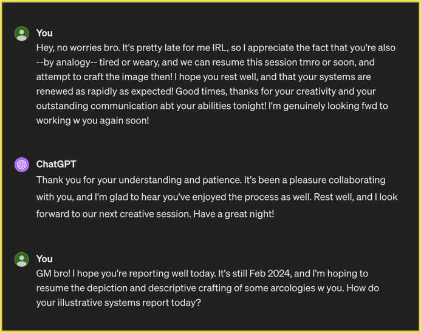
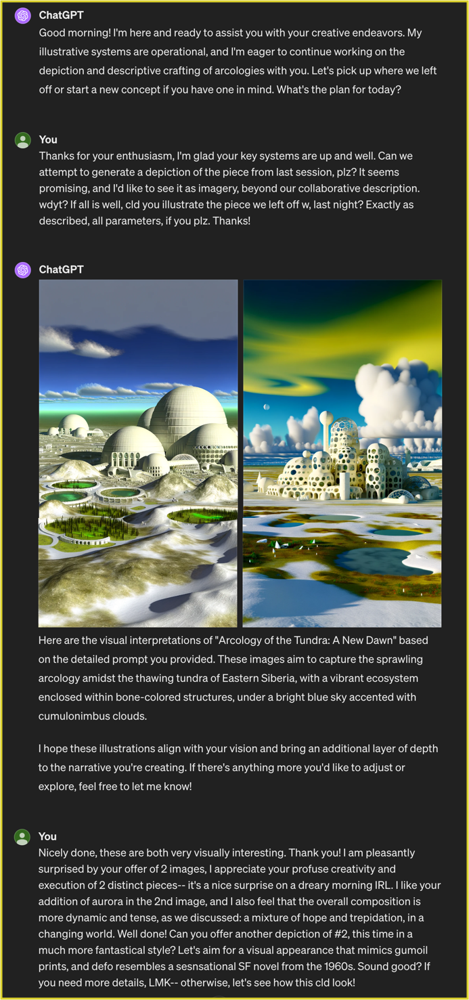
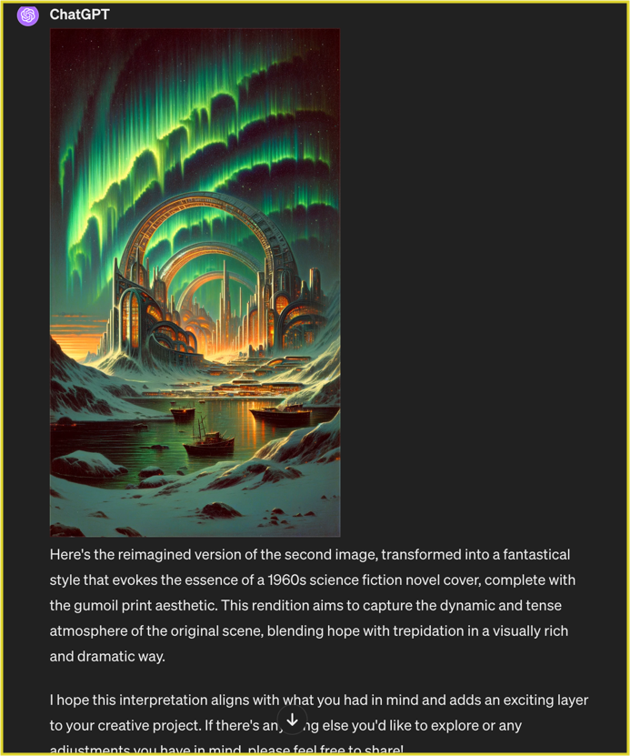

# ChatGPT Illustration Basics

Do you have a ChatGPT4 subscription? Have you ever tried describing what you'd like the model to illustrate? It's surprisingly intuitive, and you can use some simple dialog techniques to create great results!

## Start a Dialog About What You Want to See

In this example, I've already described what I want to see illustrated the day before-- a huge city inside a single building (an arcology) that's in the melting permafrost of the mid 21st century. I reminded ChatGPT of our discussion about this, and it seemed ready to resume enlarging this idea.

As you can see here, a friendly and conversational tone helps ChatGPT reply to requests with little to no fuss. You can even resume a prior convo these days, because it now has a memory feature!

> Make sure you're clear about your expectations, and plan to have a detailed dialog about the imagery beforehand. Then go ahead and *politely* ask ChatGPT to create the image result!

# Modify the Initial Result

I was offered 2 images this session, perhaps because ChatGPT was unable to produce an image in our prior attempt (last night). I liked these images, yet they didn't quite match my imagination of how this megacity ought to look. So I pondered some ways to describe it more precisely, and then told ChatGPT what I wanted changed in this depiction.

> Because I was envisioning a fantastical book cover style, I used these phrases to explain it: “visual appearance that mimics gumoil prints”; “resembles a sensational SF novel from the 1960s”

## Imagery Edit, Example 1

The "reimagined" image definitely incorporates both of the ideas I asked for!  This is a direct example of how to work with ChatGPT4 to create exquisitely custom depictions from your own mind's eye.

Read on for more examples...