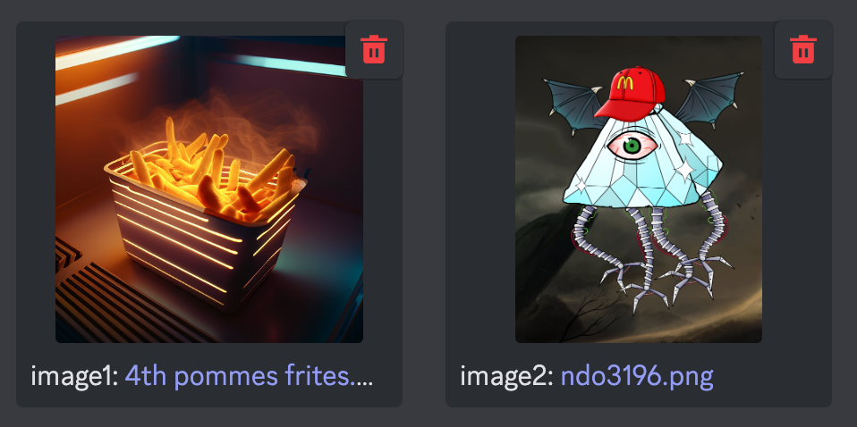
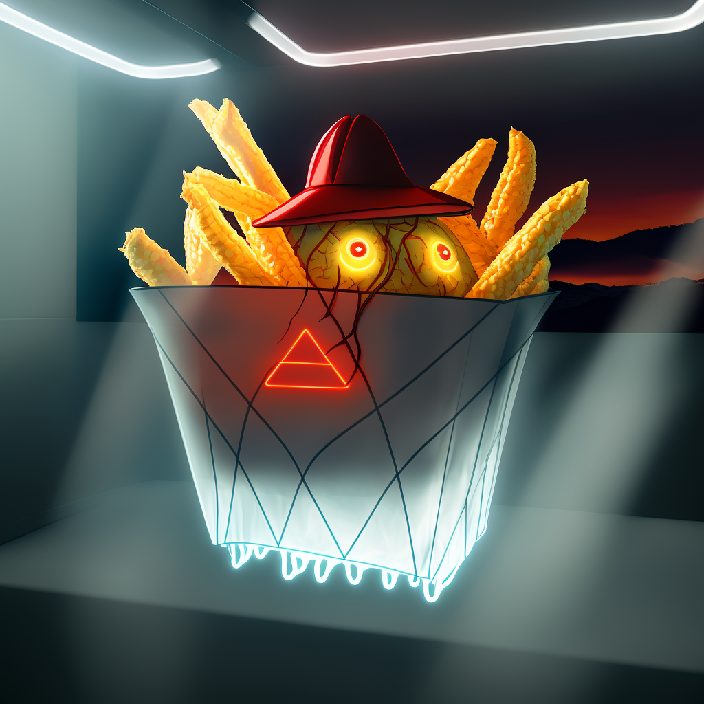

# AI Art: Midjourney Basics

Midjourney is a copyrighted, closed-source tool that's available via Discord chat app. Many servers are offering it as a new party game, but how to start capturing your imagination into visuals? This guide will get you moving forward, and then you can learn more as you go.

> There are many paramilitary merfolk, but plz draw w/e you wish

## How to start
- 1️⃣ Go to the mid-journey chat in your server
- 2️⃣ type in */imagine*
- 
- 3️⃣ the *prompt:* will show up, and you can describe what you wanna see it synthesize in there & then press return

## How to drive
Prompt is the default way to leverage AI art (some are calling it 'synthography'). The complexity of the prompt can work in your favor or it can make things too confused. Experiment, and use this broad format to start out:

> THING doing THIS. style, style, style, style, style, THING, style

Try using cinematography terms, the midjourney tool understands different cameras and can take some direction on how to compose the scene; but it will take many attempts so you'll soon learn how to use the revision buttons. 

Things to note:
+ The 1 thru 4 is just which image it's gonna Upscale or create Versions.
+ The U and V buttons will enhance and make more versions, respectively.
+ And the 🔁  button re-rolls the prompt w a new seed 🌱.

## Redo &c
After many V cycles you'll want to finally U your favorite result. Once you do, there will also be *Redo* options. These are strange, and sometimes make the image a very different style. Nothing is lost, so experiment and enjoy!

The prompt above is what created the tactical mermaid troop, so feel free to adapt it for your own use.

## /blend not /imagine

A novel feature in the current MJ is the */blend* command. Use this instead of /imagine and it will request /image1 & /image2. Upload these and you'll receive 4 mashups of the two visuals, which is most useful over several attempts, or to refine a good idea by adding some new colors or motifs.

Here are two images chosen, a pommes frites & a diamond NewDegenOrder pyramid.

> Behold their ineffable blended result! This was after I pushed V a few times, and then Upscaled my favorite one. 

## /imagine examples

> marzipan carving, 3D laser printing, combat medic, anthro lady duck. steampunk, neoclassical, rococo, 8k

> basket of potato fries in their coffin of hot fry grease in a downbeat McD kitchen at 9:15am. octane render, Global Illumination, Screen Space Global Illumination, Ray Tracing Global Illumination, Optics, Scattering, Glowing, Shadows, Rough, Shimmering, Ray Tracing Reflections, Lumen Reflections, Screen Space Reflections, Diffraction Grading, insane details, realistic, Shaders, OpenGL-Shaders, GLSL-Shaders, Post Processing, Post-Production, Cell Shading, Tone Mapping, CGI, VFX, SFX, insanely detailed and intricate, hyper maximalist, elegant, super detailed, dynamic pose, photography, volumetric, ultra-detailed, intricate details, 8K, super detailed, ambient occlusion, volumetric lighting, high contrast, soft tones

Remember to share this new art movement with your frens, and maybe invite the Midjourney bot to your home Discord server, too!

## My donation links:

- EGLD: [j4cks.multiversx](https://explorer.multiversx.com/accounts/erd159mypt4myss3mqrs89ft0hjeacffks2690gq9u3mlh73m9sh0w5s09eqhh)
- TeriTORI: [tori15q6kvcs5r5sutn8s5nvk5tpq7ztgxre6ss5urh](https://www.mintscan.io/teritori/account/tori15q6kvcs5r5sutn8s5nvk5tpq7ztgxre6ss5urh)
- KUJIra: [kujira15q6kvcs5r5sutn8s5nvk5tpq7ztgxre6rvpd4d](https://www.mintscan.io/kujira/account/kujira15q6kvcs5r5sutn8s5nvk5tpq7ztgxre6rvpd4d)
- ETHereum: [j4cks.eth](https://etherscan.io/enslookup-search?search=j4cks.eth)