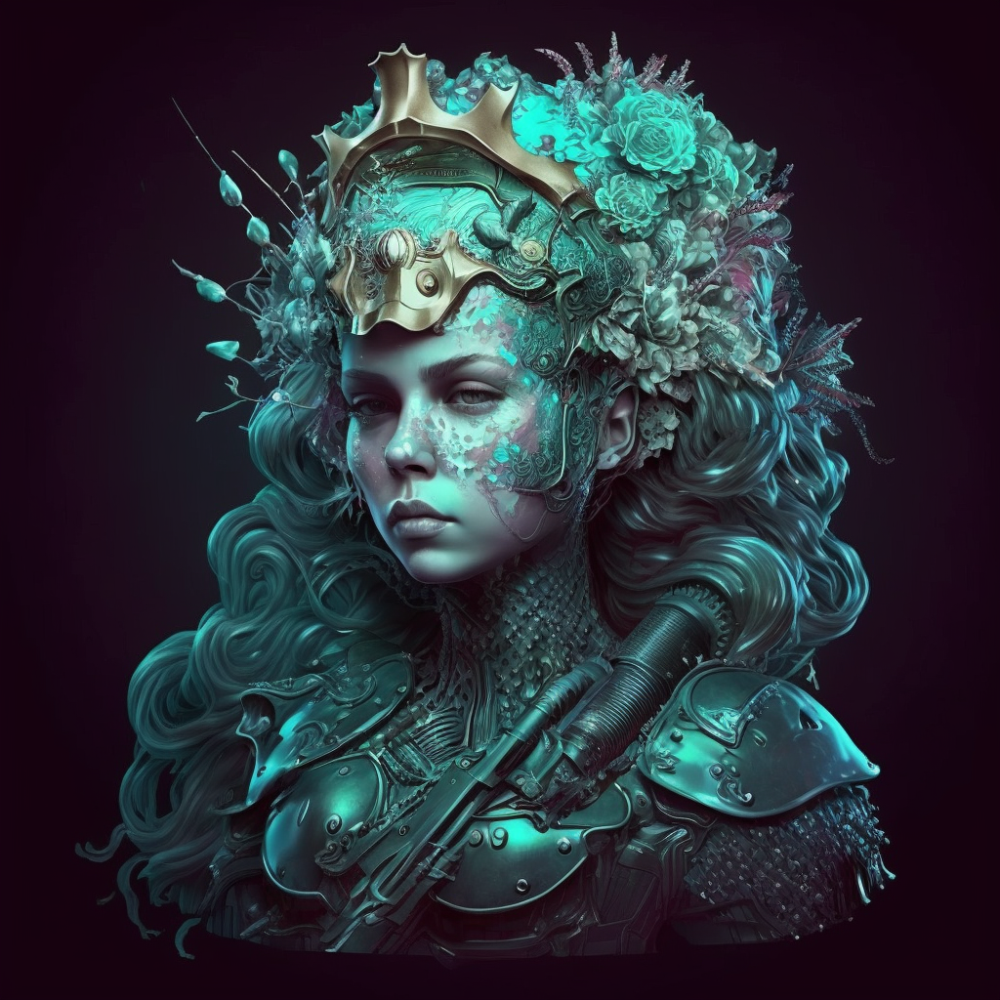
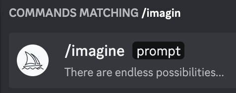
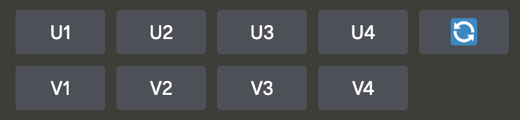
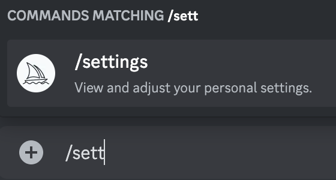
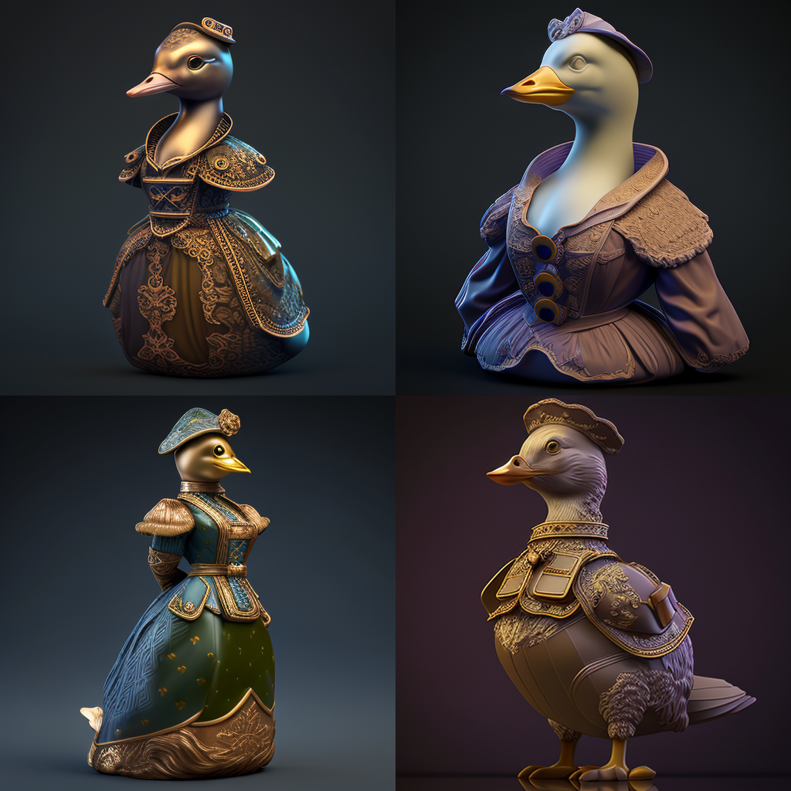
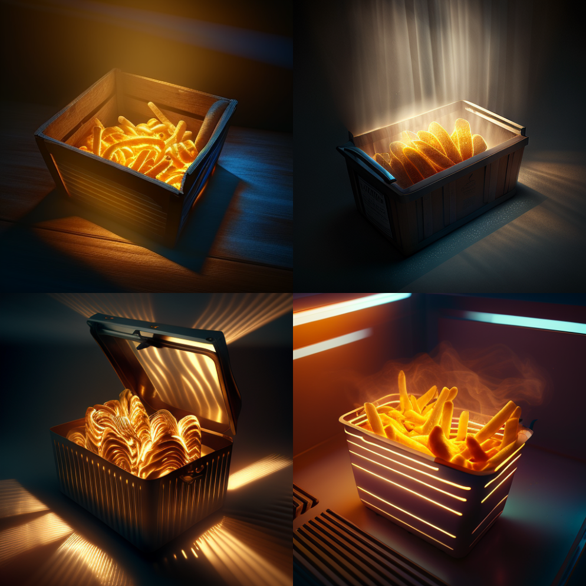

# AI Art: Midjourney Basics

Midjourney is a copyrighted, closed-source tool that's available via Discord chat app. Are you interested in capturing your imagination into visuals? This guide will get you moving forward, and then you can learn more as you go.

> There are many paramilitary merfolk, but plz draw w/e you wish.

## How to Imagine
- 1️⃣ Go to the Midjourney server in Discord. You can also DM with the MJ bot instead of doing the prompts in a public room, yet you'll learn more working in public.
- 2️⃣ type in **/imagine**
- 
- 3️⃣ the space to *prompt:* will show up, and you can describe what you wanna see it synthesize in there & then press return

 
#### It's best to write your prompts in another app, so you can easily paste them in and edit them as you work and revise.

## AI Art Grammar
Prompt is the default way to leverage AI art (some are calling it 'synthography'). The complexity of the prompt can work in your favor or it can make things too confused. Experiment, and use this broad format to start out:

> **THING doing THIS. style, style, style, style, style, THING, style**

Try using cinematography terms, Midjourney has been trained to understands different cameras and can take some direction on how to compose the scene! 😅 Also, try requesting things "in the style of" whatever you wish. You can mention creator's names, too, but that's not as much fun imho. 

Whatever you do, you don't have to keep starting from scratch-- use those grey buttons, the revision commands.

### Variation & Upscale:
+ The 1 thru 4 notation is just which image it's gonna **Upscale** or create **Variations** of.
+ The U and V buttons will **upscale** and **vary** the image, respectively.
+ And the 🔁  button re-rolls the prompt with a new seed 🌱. aka **Redo**

After many **V** cycles you'll want to finally **U** your favorite result. 

### Redo &c
There are also **Redo** options, which are offered after an Upscale, and can be done anytime w the 🔁 button. I'd advise against burning too many credits on the Redo bc they sometimes make the image a very different style. 

You can always access everything you've ever made at the [main Midjourney site](https://www.midjourney.com/app/), without opening Discord. Nothing is lost, so experiment and enjoy!

The prompt above is what created the tactical mermaid troop. Feel free to adapt it for your own use. Short and vivid prompts work best. (You can change your settings and fine tune your workflow with the **/settings** menu. Perhaps MJ v4 or v5 will work better for what you're envisioning. 🤷‍♂️ Experimentation is the essence of this craft, so try and find out!)

### /imagine examples

> marzipan carving, 3D laser printing, combat medic, anthro lady duck. steampunk, neoclassical, rococo, 8k

> basket of potato fries in their coffin of hot fry grease in a downbeat McD kitchen at 9:15am. octane render, Global Illumination, Screen Space Global Illumination, Ray Tracing Global Illumination, Optics, Scattering, Glowing, Shadows, Rough, Shimmering, Ray Tracing Reflections, Lumen Reflections, Screen Space Reflections, Diffraction Grading, insane details, realistic, Shaders, OpenGL-Shaders, GLSL-Shaders, Post Processing, Post-Production, Cell Shading, Tone Mapping, CGI, VFX, SFX, insanely detailed and intricate, hyper maximalist, elegant, super detailed, dynamic pose, photography, volumetric, ultra-detailed, intricate details, 8K, super detailed, ambient occlusion, volumetric lighting, high contrast, soft tones --v 4

Enjoy and remember to share this new art movement with your friends.

Here's the official docs to Midjourney with [all the current commands](https://docs.midjourney.com/docs/command-list). Keep reading here to learn about the next mode, **/blend**.