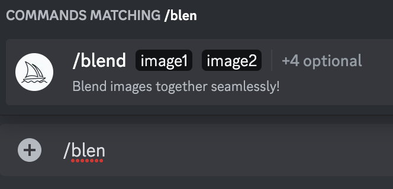

# AI Art: Midjourney Basics, Cont'd

Interested in going deeper than prompting your imagination with words? Try the second popular mode, introduced early 2023 in Midjourney version 4, the **/blend**.

> These images were crafted from 2 other images, without a word prompt.

## /blend not /imagine
A novel feature introduced in version 4 is the */blend* command. Use this instead of **/imagine** and it will request /image1 & /image2. Upload these and you'll receive 4 mashups of the two visuals, which is most useful over several attempts, or to refine a good idea by adding some new colors or motifs.

## How to Blend
- 1️⃣ Go to the Midjourney chat in your server. You can also DM with the MJ bot instead of doing the prompts in a public room, yet you'll learn more working in public.
- 2️⃣ type in */blend*
- 
- 3️⃣ the *uploads* will show up, choose 2 or more images from your device to upload and that's it!
- 

In this example I chose a pommes frites & a diamond NewDegenOrder pyramid.

Behold their ineffable blended result! This was after I pushed **V** a few times on the blend output, and then **Upscaled** my favorite one.

Enjoy and remember to share this new art movement with your friends.

Read on to learn how to fuse these two modes together and become an advanced Midjourney user!