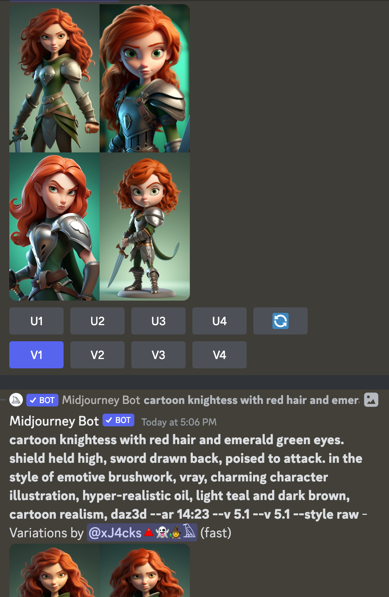
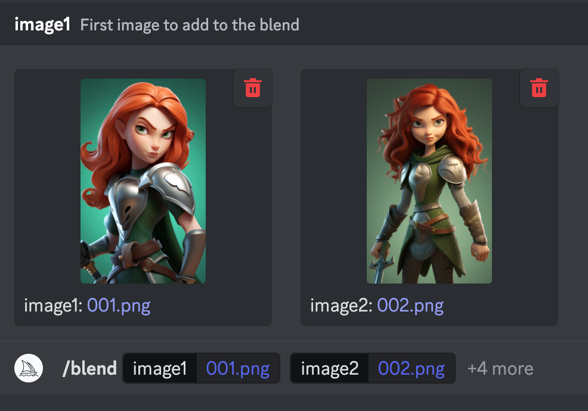
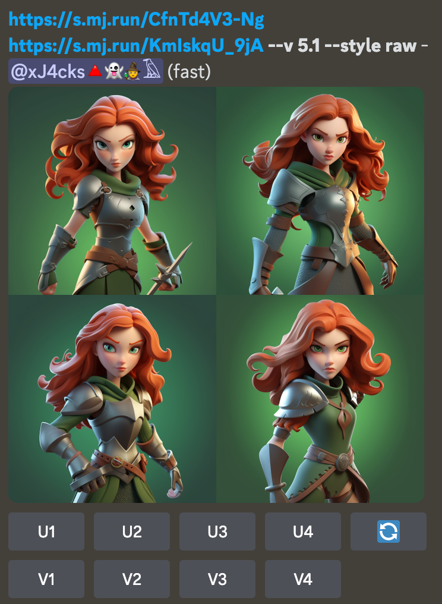
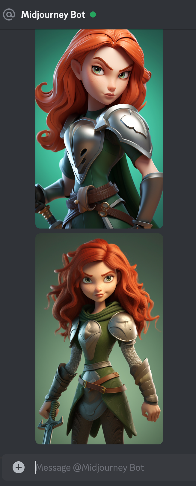
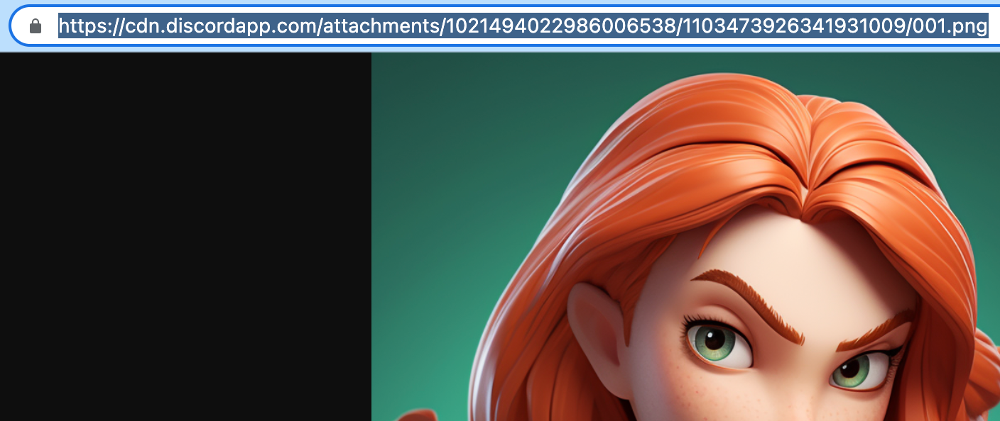
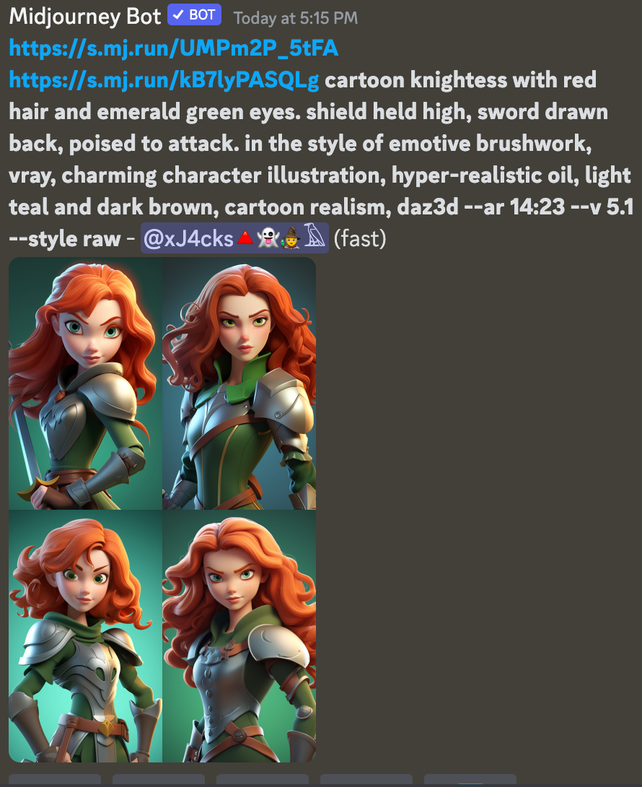

# AI Art: Midjourney Advanced

Once you have a grasp of the basic **/imagine** and **/blend** tools in MJ, it's time to combine them into one technique. This is detailed [here](https://docs.midjourney.com/docs/image-prompts) in the docs and I've found it's the most precise and intuitve workflow so I'm pleased to share this with you.

## Image Prompts


> Let's assume you have 2 or more images that you like, and you want to blend elements of them together WITHOUT losing the impact and details of the cool prompt that made them. There's an easy way to do this but it's not obvious, so read on!



> If you use the **/blend** command on 2 images and find that the outputs lose some elements that you want, this is exactly the technique that will help you. You can also selectively add or remove details! 



> In this case we can see how this **/blend** lost track of the originals' dynamic pose (and so much more 🤦‍♂️). Let's use the "image prompt" mode to get the original prompt back in there, too!



> <i><b>Upload</b> any images you want</i>, use the "⊕" button and they'll show up in Discord. Can't get more direct than this, right??



> Now Click on each image. *Retrieve the images' URLs*. (Open them in a new tab, and copy/pasta them into your prompt... Easiest on a 💻, challenge mode on a 📱. Remember how I advised you to work in another app & never just compose in the Discord chat?)



> Okies, you're all set, go ahead and **/imagine w this image-full prompt**! Oddly, that's all there is to this technique! 😹 


I think you'll find it's hella precise compared to /imagine without images, or to /blend! With this approach MJ gets to reference both images and words, so you can *refine or add to the original prompt*. Zero in on whatever features are missing and keep refining! You're "putting bombs on target" as they say in the 2nd Air Force.

Here is the prompt w the exact image links I used in this example. IDK if the MJ links will last very long, but give it a try with your own images ofc!

```
https://cdn.discordapp.com/attachments/1021494022986006538/1103473926341931009/001.png https://cdn.discordapp.com/attachments/1021494022986006538/1103473962220003498/002.png cartoon knightess with red hair and emerald green eyes. shield held high, sword drawn back, poised to attack. in the style of emotive brushwork, vray, charming character illustration, hyper-realistic oil, light teal and dark brown, cartoon realism, daz3d --ar 14:23 --v 5.1 --style raw
```

Enjoy and remember to share this new art movement with your friends.