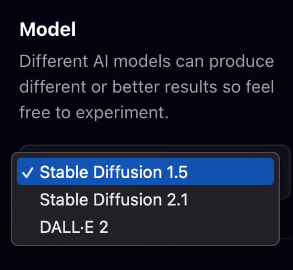
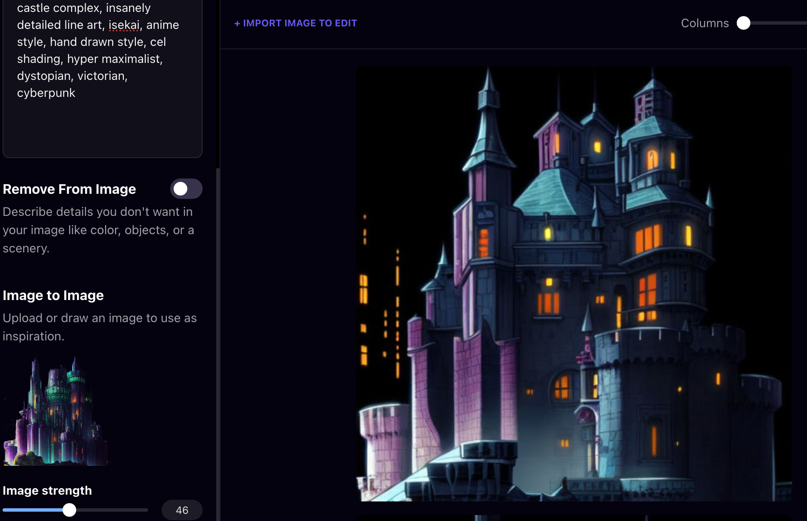
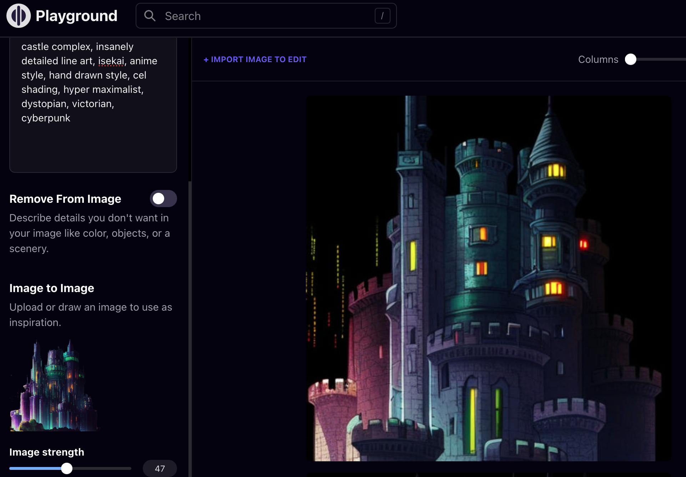

# AI Art: Playground Basics

[Playground AI](https://playgroundai.com/create) is a deployment of open-source tools like Stable Diffusion that's available online, with generous free credits. This guide will get you moving forward, and then you can learn more as you go.

## How to Start
- 1️⃣ Feed it an image prompt, as if it were Midjourney. Expect rougher results.
- 2️⃣ Experiment with the different engines, save good stuff.
- 

## Now for Image to Image
This is just magic, there's no need to get too technical about it. 🧙 Choose StableDiffusion 1.5 and then... 

1. Upload one of the good results you've made with Playground or Midjourney with the *Image to Image* button in the bottom of the left panel.

2. Add a Prompt up top as usual: the output will get steered by the uploaded image!

3. Move the image strength slider to Control how much influence you want the Image you're uploading to have on the Image you're prompting. (30 is the start. Experiment, and discover.)

> "castle complex, insanely detailed line art, isekai, anime style, hand drawn style, cel shading, hyper maximalist, dystopian, victorian, cyberpunk" at Image strength 46

> Same prompt, but one tick higher at 47! This seems like a borderline to me, your results will vary.

Remember to share this new art movement with your frens! StableDifusion may seem like a poor competitor to Midjourney, but don't judge it too quickly-- it requires much more verbose and particular prompts, and I'm not experienced enough at this time to offer a guide beyond this killer **Image to Image** feature.