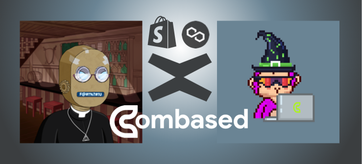
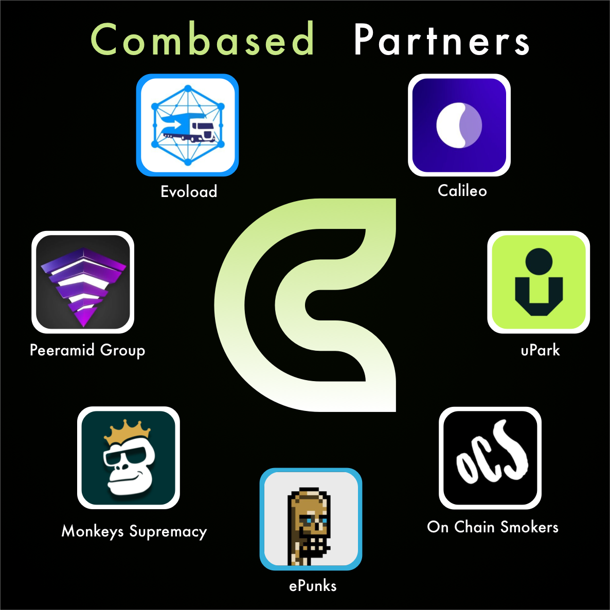

# Combased

SaaS consulting agency, founded in 2021 in Lithuania. Here's our profile on [LinkedIn](https://lt.linkedin.com/company/combased).

Web3 means many things, yet it definitely means decentralized workflow. Combased is an amazing team of biz and code devs who meet and collaborate remotely to consult at the edge of web3 and web2. Working mainly on MvX (Elrond) and Polygon, we've helped traditional companies utilize NFT and blockchain tech all through 2022. Combased team has built custom dapps for clients, custom NFT minting portals, and has authored an affiliate program that rewards holders of our NFTCommerce pass.

While it's crazy cool that all this is happening, it's even cooler that the web3 spirit of community is taking place with profit sharing, too! A large chunk of the consulting profits are placed into the community treasury, where they are amplified by financial tools in Maiar Exchange and then shared regularly with company shareholders-- in this case, NFT owners!

Are you beginning to see why we've grown so fast this year? Our global talent pool of promoters and devs is sourced from passionate fans, 
and that is built around rewarding NFT collections that keep getting more rewarding the faster we grow, and the more clients we land!
 
[Visit Combased Discord](https://discord.gg/nh46kvc3Fa) for all the info on our dynamic and evolving reward programs, and to meet the founders and many of the people who help build the partnerships and apps.

We've built for these companies, and we continue to enjoy working with new clients by word of our successful partnerships.

Here is our official [Combased Twitter](https://twitter.com/combased_app).
