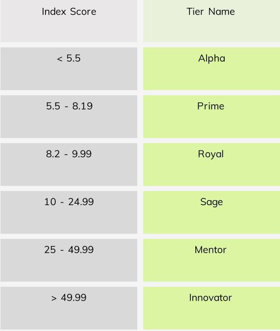
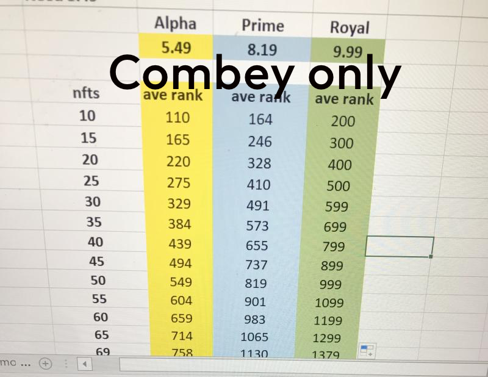

# Passive Income on MultiversX from ComVerse

There are 6 reward tiers-- every wallet on MultiversX with at least one ComVerse NFT automatically has an index score assigned and therefore qualifies for one of these tiers.

The index score is based on both the number of ComVerse NFTs in the wallet & their rarity; literally the scores of the 'rarity' metadata property of all the NFTs, averaged out (with some weights) yields the index score. 

    Above is a table of the Combased reward tiers. Alpha gets most.

## How to find your index score? 

Just log in at [Combased.io](https://nfts.combased.io/unlock) and you'll see a score reported above the minter!

You can double check the math using a spreadsheet or etc with this formula:

*Take the AVG of all the rarity numbers, then divide by 2x the number of NFTs*

Do this for the Combeys in the wallet, then do this again for the Combots. The averge of both scores is the wallet's final index score.

Want to analyze this strategy without resorting to mathematics? Just think of it like this: wallets without super rare ComVerse NFTs will still rank high when they have enough NFTs. 

Here's a quick chart that NiceGuyIan (another member of CombasedClub) and I drafted a few weeks ago. This only works for the Combey collection, which has 1555 items. The Combots are more rare, only 999 exist.

[Visit Combased Discord](https://discord.gg/nh46kvc3Fa) for more info, it's not as complicated as it looks yet it usually helps to discuss stuff like this with someone.

Here is our official [Combased Twitter](https://twitter.com/combased_app).
