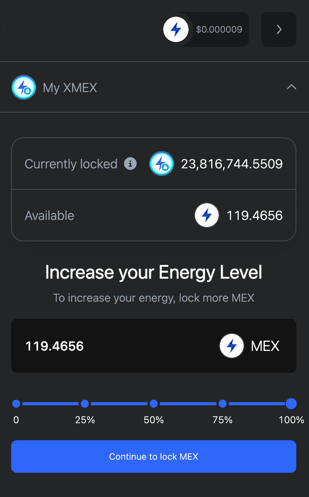
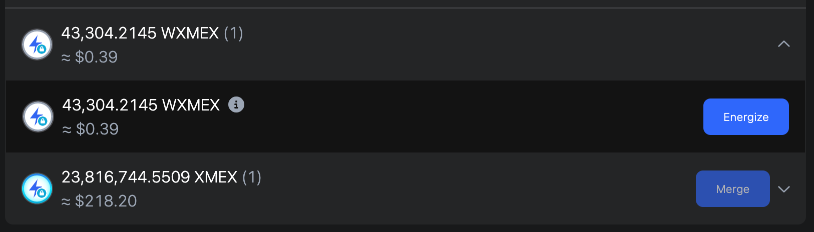
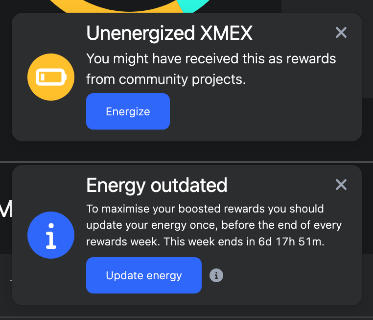

# xExchange Decentralised Exchange

## Why use a DEX?

An under-appreciated aspect of MultiversX is the suite of financial tools found on [xExchange](https://xexchange.com). Because they run on a blockchain DEX instead of legacy financial (TradFi) systems, these tools fall under the blanket of "DeFi".

> 👉 You can lend your tokens and EGLD to financial instruments built with web3 code (smart contracts) and earn more.

## Metastaking

The Staking of UTK, CRT, ASH, and other tokens is fairly straightforward, and offers good APYs that do fluctuate quite often, though. Expect to wait 10 days to fully retrieve (unbond) your tokens from Metastaking farms.

## LP Staking (Liquidity pools)

If you loan collateral to the xExchange, you'll receive fractional rewards based on all the swaps between the pair of tokens you're loaning. The larger the locked value in these liquidity pools, the more stable they are against quick price movements. Conduct lots of research on this inarguably powerful way to generate currency, then start testing it with a mainstream pair like EGLD/UTK or EGLD/USDC. 

## Energizing XMEX to Earn Passive Rewards

This is a very arcane mechanic, yet incredibly lucrative over time. Most MultiversX users never bother to spend the time to learn about the DeFi systems, which all flow from the idea of XMEX, the xExchange's own token. If you hold an ElrondApe, MaiarWizard, or a Genesis ComVerse NFT, you'll receive free XMEX on a regular basis, so you might as well learn how to leverage it for free tokens.

### Claim & Energize

> Step 1: Claim your free XMEX (and MEX, and other tokens) on the xExchange

You'll have free earnings weekly, so claim them first off.

> Step 2. Now lock up the free MEX you claimed into XMEX...

Then Energize it to the max (4 years)

This boosts your xExchange Energy as much as possible, using the weekly free claim tokens.

### Double Check You Are XMEX Maxxed

Finally ensure you utilize all the XMEX you receive from those alpha community projects (EApes,MWizards,ComVerse). Energize if this prompt pops up, and keep watching your weekly claim rewards increase!

Stay tuned for deeper guides to some of these topics.

## Keep it Secret, Keep it Safe

Never, ever input your 24 words that control your xPortal blockchain address. This will give away everything in your wallet, and you'll likely lose all the staked assets, too!