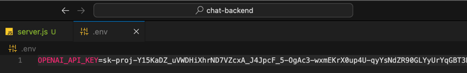
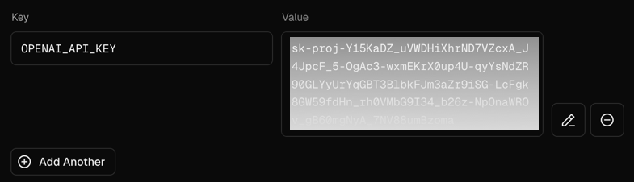

# ChatGPT Backend Scaffold

## What and why

As I explained briefly in the previous post, Generative AI can handle sophisticated data transformations, making it a cutting-edge choice as the backend for applications. I am learning to leverage OpenAI's ChatGPT to craft custom app logic with a low-code template approach.

Once you have a basic website set up to communicate with your backend (see previous article), here is what a supporting API that uses ChatGPT might look like. I'm hosting mine on [vercel](https://www.vercel.com) as I like their quick deployment and clean UX, yet any cloud provider can work as an API once you install the ChatGPT modules and define what you expect it to do for you.

## Baseline ChatGPT API

First off, set up a basic node project and store the code on GitHub or a similar service.

An example of the essential backend code is shown below. Save it in a file named ```server.js``` 

## Baseline Template

```js
const express = require('express');
const cors = require('cors');
const OpenAI = require('openai');

const app = express();
app.use(cors());
app.use(express.json());

const client = new OpenAI({ apiKey: process.env.OPENAI_API_KEY });

app.post('/chat', async (req, res) => {
    const { prompt } = req.body;
    
    try {
        const response = await client.chat.completions.create({
            model: "gpt-4",
            messages: [{ role: "user", content: prompt }]
        });

        const botReply = response.choices[0].message.content;
        res.json({ reply: botReply });
    } catch (error) {
        console.error('Error in OpenAI API call:', error);
        res.status(500).json({ error: 'Error communicating with the bot' });
    }
});

module.exports = app;
```

## Get your Key

Next, generate an API key using your OpenAI account. Copy this somewhere safe, and create an .env file for it at your project root, to allow this project to run and to test it on your local machine. 


> Ensure you add the ```.env``` to your gitignore, so this file and your key are never exposed on GitHub.



Then give your cloud host (vercel shown here) the same key and value, in the project's Environment Variables.



Once the API key is copied securely to your host, then the API server code can work as intended with your remote deployment, not just on your local machine.


## Things to Note:

- you will need to [create a free account with ChatGPT](https://platform.openai.com/signup) to enable this level of custom utility

- the code above simply queries the ChatGPT service for a chat connection; it is extensible for many features, to include reviewing documents as seen in our demo [Paralegal Document Review app](https://jacks.media/docreview)

- this is the first half of a 2-part project: the fronted code is offered in the previous guide

## Stay tuned for more AI integration content
