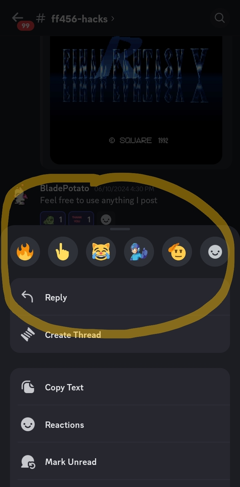

# How to Direct reply in Discord

There are two ways to make a linked comment on someone's message, so that *your* message will be visually linked to theirs. This is important for busy, popular chat rooms (servers) where several convos can happen at the same time. Without linking your reply like this, it's extremely unclear what you're replying to, and this can become tiresome in busy communities.

### Mobile

On mobile, you can "long press" on their message, and then whatever you write will show up with a reference back to their message.

### Keyboard

If you have a cursor then you can right-click on their message, and this will also create a linked reply.

Both of these methods will create a notification for other user that you've commented on / replied to them. This is great Discord etiquette and also creates an easy-to-reference chain of thoughts for anyone who reads the text.

## Call someone out

If you're simply trying to reply to another Discord user and don't want to reference anything they wrote, there is another way to get their attention.

Use the **@** before their name as you type, and they will receive a notification of your message. Everyone in the server will also see the username after the **@** in bold type, so this is a good way to focus attention on a dialog between you and the person you're "@ing".

### Hang in there, more guides on this topic will appear soon!