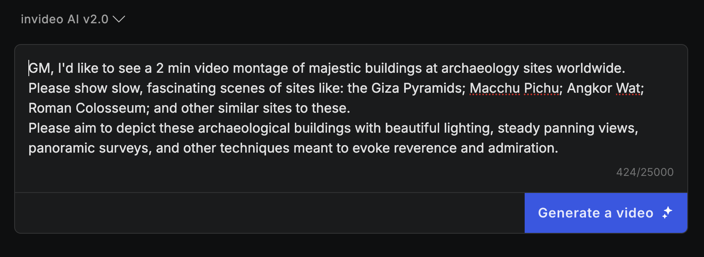
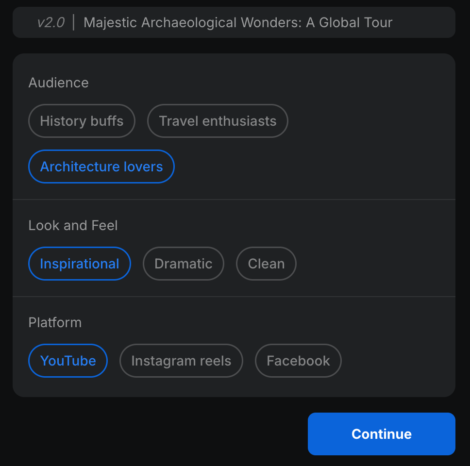
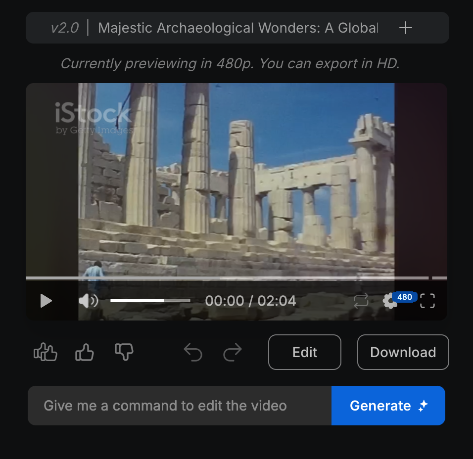
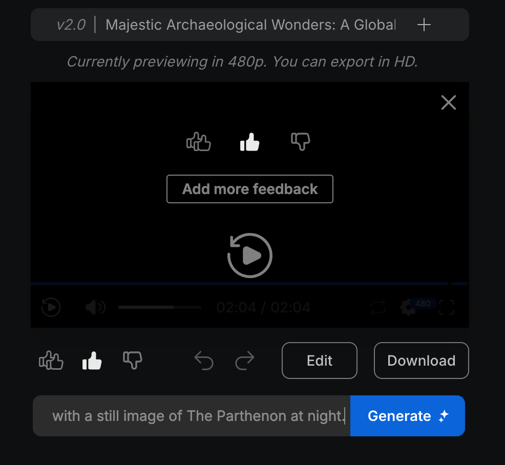
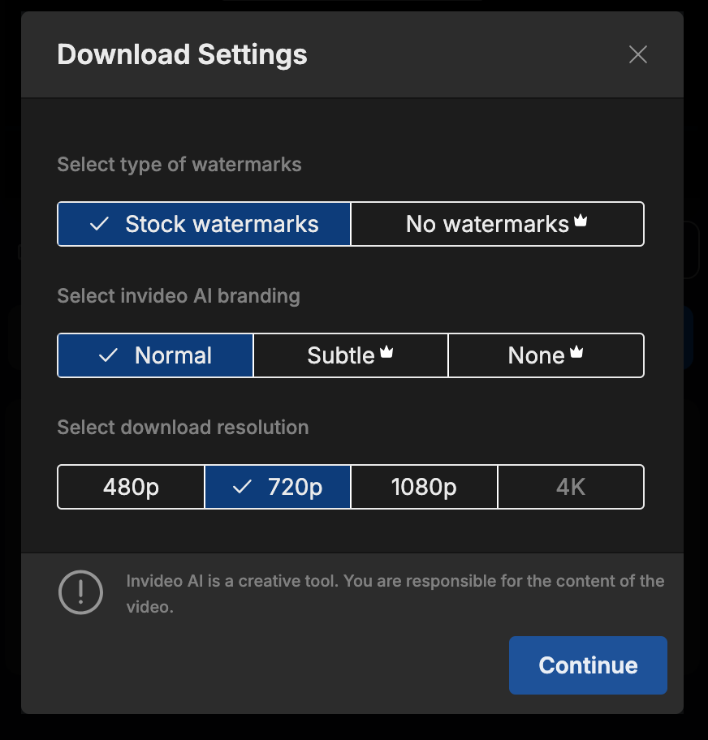
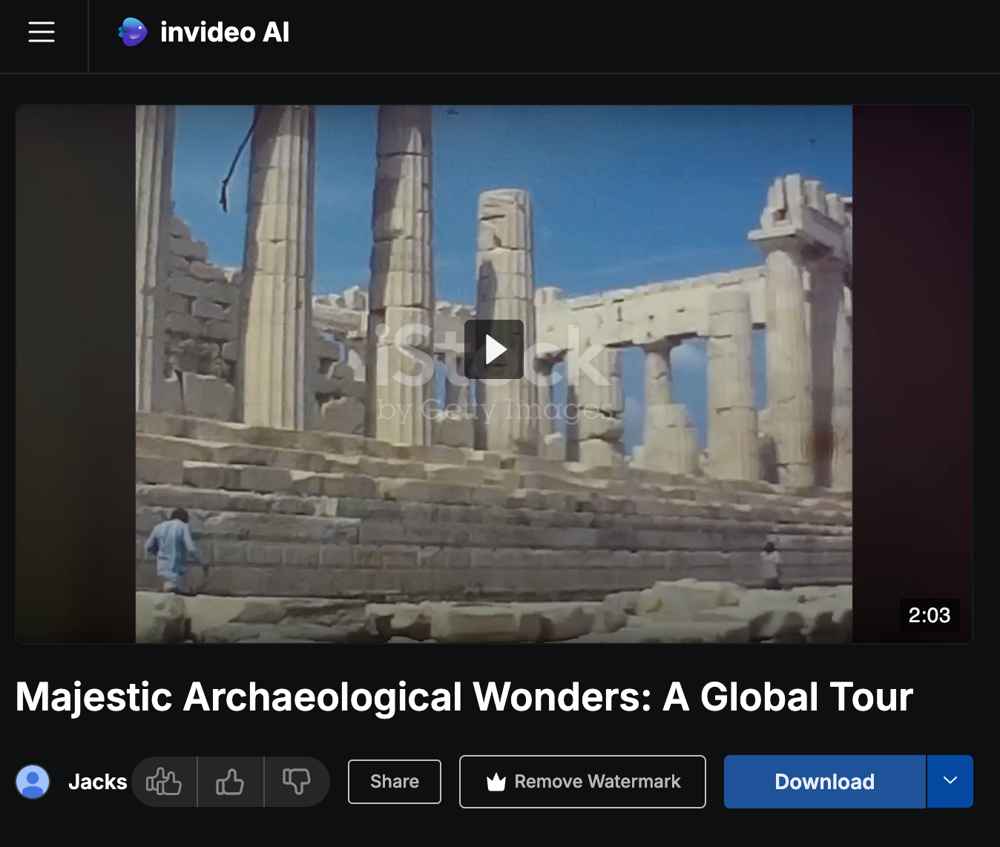

# Make a Quick Video

## What to Know

We live in an age of accelerating wonderment, and it's now possible to generate videos from stock footage and copyfree resources. If you're competent with prompting genAI images, then you ought to try prompting a video, too!

## Which Tool to Use

[Invideo](https://ai.invideo.io/) is the easiest option to begin learning how to make generative AI videos.

## How to Prompt Videos

This is quite similar to prompting images, yet it's more involved because each scene of the video must get described accurately.

Describe the styles of how you want your video to look, and to move (cinematography).  Do this in a note app, and break apart the different scenes into paragraphs-- invideo expects up to 25000 characters, so this is truly like prompting multiple images. I'm offering a very simple example here, but there's space enough for many pages of text.

Then give the app some target audience details, to help it direct the results more intelligeently. 

### When everything seems suitable, go ahead and request the video.

You can refine it over and over, after the first result, so don't spend excessive time on the first draft-- expect to adjust your prompts in a chat with the invideo bot after watching the initial video!

Finally, you can download the results, which will be packaged with watermarks and in as high definition as 1080p. Paid users can get 4K videos without watermarks.

## My Example (in)Video

### [Click to watch the example on YT](https://youtu.be/5rE9-NUB68c)

### Invideo is fairly easy to use, right?

If you want help expanding on your concepts for your generative video, why not discuss it with ChatGPT or a similar service? Those AIs will eagerly help you describe your idea and enlarge it into a great prompt for invideo! 

Check out other guides on this site, too!