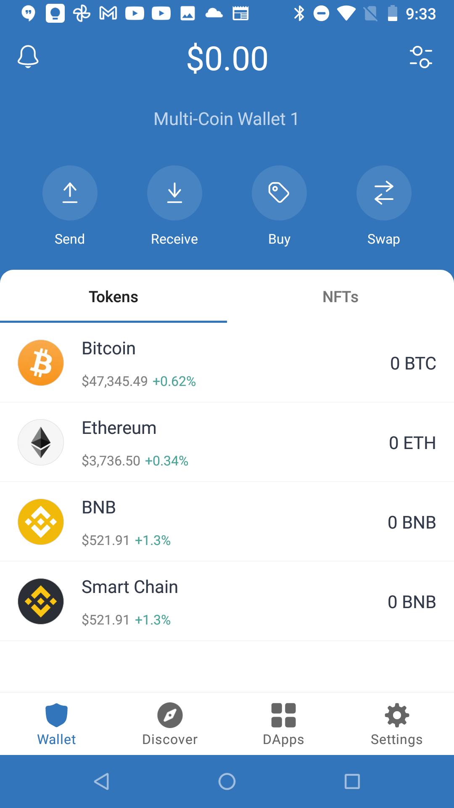
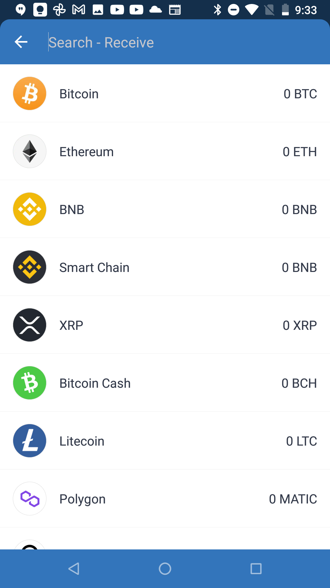
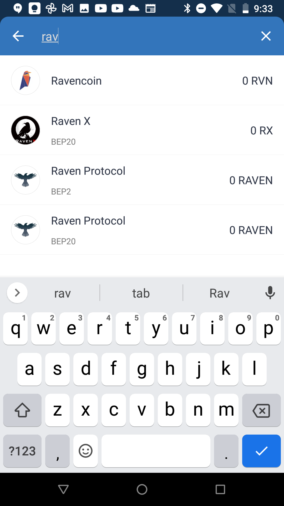
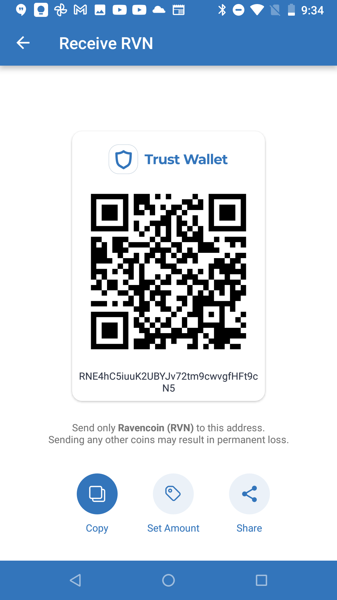

# Wallet & Pool

## 1. Download Trust Wallet

Grab [this basic crypto wallet app](https://trustwallet.com/deeplink/) from the Play or App Store.

:::warning
If this is your 1st time using Trust Wallet: write down your Key Words and save that piece of paper somewhere safe & far away from your phone. These are the recovery keys for your Ravencoin, so take it seriously.
:::warning

## 2. Config Wallet for RVN crypto

> No Ravencoin in our wallet yet. Let's choose to open a pocket (wallet address) to receive our mining profits.

## 3. Press the Receive button up top

## 4. Look for Ravencoin
> Then just choose the 1st result (accept no imitations)!

## 5. Copy your New RVN Address
> And of course, keep this address available for the next steps.

## 6. Join the Nanopool of Miners

> This is easy. You can join without any permission, because crypto is decentralized and DIY by nature! Nanopool will send your mining rig shares of work as soon as you ask for them, so just check out [www.nanopool.org](https://www.nanopool.org) for a quick tour of your new hobby's guildhall.

Under the Ravencoin subpage you can see the current power of the nanopool. Soon you'll be adding +1 to the 'Miners' and 'Workers' totals!! 

