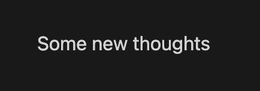
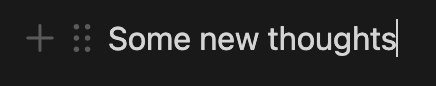
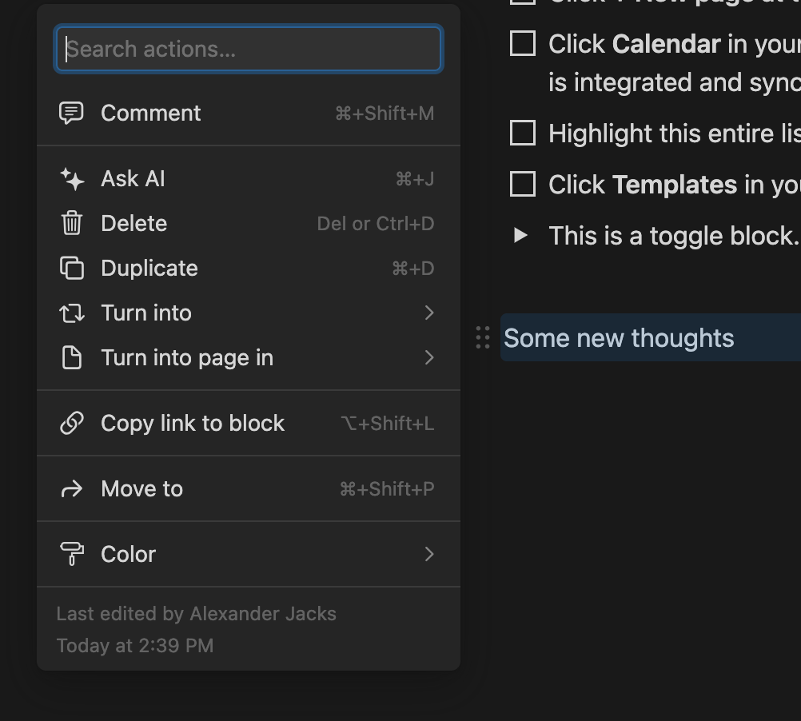
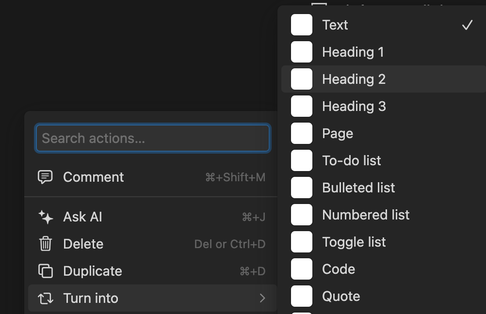
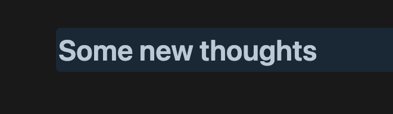
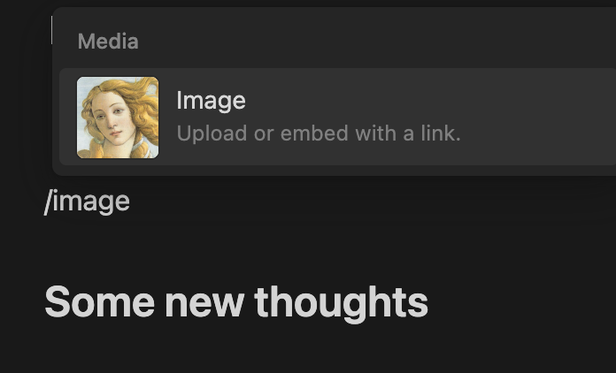
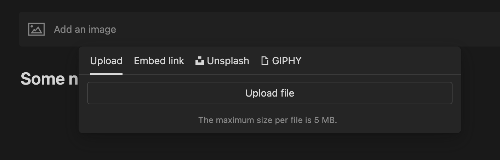

# Notion Basics

## Add New Text

Just click on the page and start typing!

## Format Text

Hover over the left side of the text you want to make bigger, or change the color, or etc. You will see a small "dots" panel appear.

Click the dots and some menu options to change the text become available.

Choose to **Turn Into** and you'll see some options...

Here is what Headline2 text looks like, versus the normal size.

## Add Image

Click where you want the image and type in the following:
> /image

Then upload it!

OR, just drag the image into your page from a directory!

### Notion is really easy to use, right?

More guides will appear here soon, so check back next week!