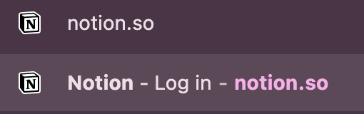
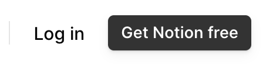
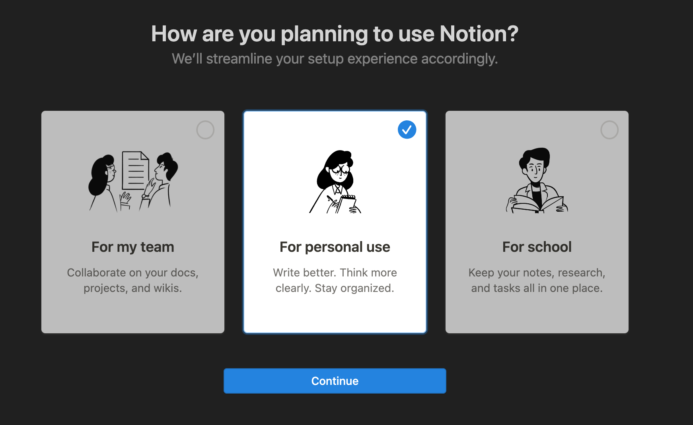
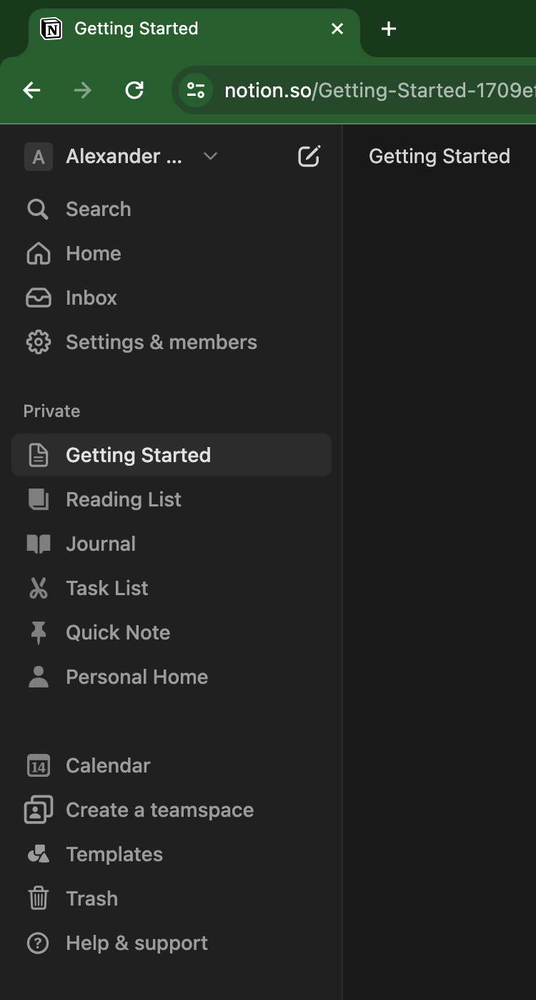

# What is Notion?

## Notes Living Online

Notion is a powerful cloud platform for jotting down thoughts and content, and it's avaiable to be used by anyone for free.  It's always online, so you can see your changes *in real time*, on the actual public internet! And it's very easy to work with, compared to other website builders

> You can document and share anything with Notion, for free. My main site is about one of my hobbies, Super Nintendo romhacking ([xJ4cks Notion](https://www.notion.so/xj4cks/Absolute-Intro-to-FFV-SNES-Romhacking-b1eb9b57f3224683b191614c7b4825fc))

## How to Get Started

Just go to [notion.so](https://notion.so) 

Select the New User "Get Notion free" button, and log in with your email.

Then choose the Personal option, and you're all set to start building!

You'll see a new site that's now tied to your email. There is a sidebar of demo sub-pages and widgets, like a calendar and more.

We'll ignore that for now, and just edit your landing page!

